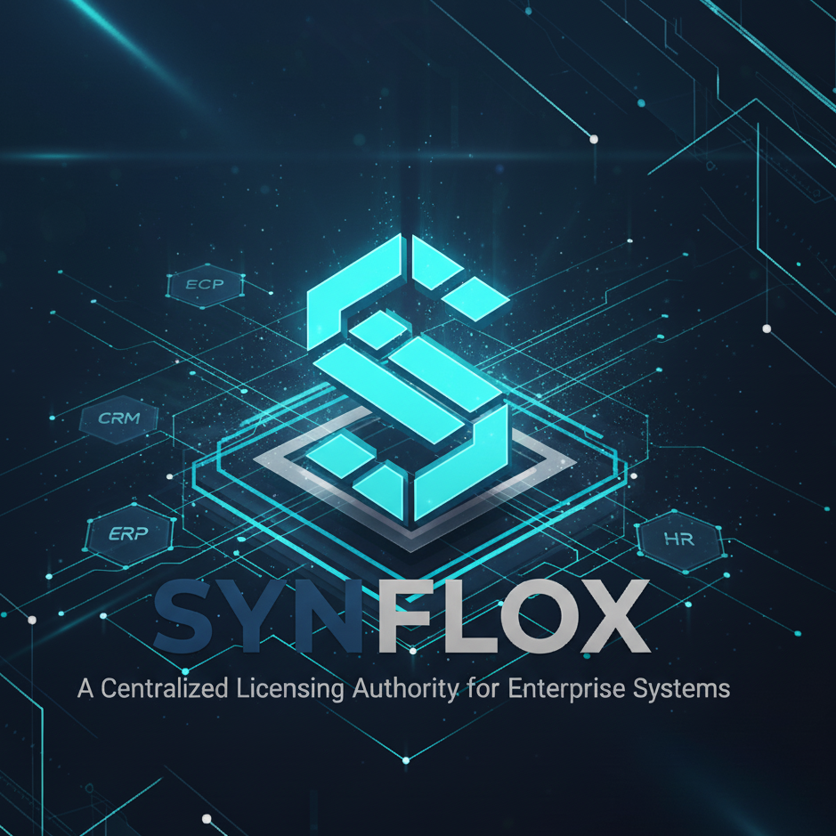

# SYNFLOX Project - Monorepo

<div align="center">



**Enterprise Central Licensing System**

[](https://dotnet.microsoft.com/)
[](https://nextjs.org/)
[](LICENSE)

</div>

---

## 📁 Repository Structure

This is a **monorepo** that organizes the SYNFLOX project using Git submodules. Each component lives in its own repository for independent development and versioning.

### **Submodules**

| Component | Repository | Description |
|-----------|-----------|-------------|
| **Backend** | [SYNFLOX](https://github.com/seifmoustafa/SYNFLOX) | .NET 8 Clean Architecture API |
| **Frontend** | [synflox-frontend](https://github.com/seifmoustafa/synflox-frontend) | Next.js 14 TypeScript Application |

```
SYNFLOX-Project/
├── SYNFLOX/              → Backend API (submodule)
├── synflox-frontend/     → Frontend App (submodule)
├── .gitmodules           → Submodule configuration
└── README.md             → This file
```

---

## 🚀 Quick Start

### **1. Clone with Submodules**

```bash
# Clone repository and all submodules
git clone --recurse-submodules https://github.com/seifmoustafa/SYNFLOX-Project.git
cd SYNFLOX-Project
```

**Already cloned without submodules?**
```bash
# Initialize and fetch submodules
git submodule update --init --recursive
```

### **2. Start Backend**

```bash
cd SYNFLOX
dotnet restore
dotnet ef database update --project WebAPI
dotnet run --project WebAPI
```

Backend runs at: `https://localhost:7001`

### **3. Start Frontend**

```bash
cd ../synflox-frontend
npm install
npm run dev
```

Frontend runs at: `http://localhost:3000`

### **4. Login**

- **URL:** `http://localhost:3000`
- **Username:** `superadmin`
- **Password:** `password`

---

## 🔄 Working with Submodules

### **Update Submodules to Latest**

```bash
# Update all submodules to their latest commits
git submodule update --remote --merge

# Or update individually
cd SYNFLOX
git pull origin main

cd ../synflox-frontend
git pull origin main
```

### **Making Changes**

**Important:** Changes must be committed in the submodule repository first, then updated in parent.

```bash
# 1. Make changes in submodule
cd SYNFLOX
# ... edit files ...
git add .
git commit -m "Your changes"
git push origin main

# 2. Update parent to track new commit
cd ..
git add SYNFLOX
git commit -m "Update SYNFLOX submodule"
git push origin main
```

### **Clone Specific Branch**

```bash
# Clone with specific branch for submodule
git clone --recurse-submodules https://github.com/seifmoustafa/SYNFLOX-Project.git
cd SYNFLOX-Project/SYNFLOX
git checkout develop
cd ..
git add SYNFLOX
git commit -m "Track develop branch"
```

---

## 📚 Documentation

### **Component Documentation**

- **Backend API:** [SYNFLOX Documentation](https://github.com/seifmoustafa/SYNFLOX)
  - .NET 8 Clean Architecture
  - Entity Framework Core
  - JWT Authentication
  - Multi-language support (EN/AR)
  
- **Frontend App:** [synflox-frontend Documentation](https://github.com/seifmoustafa/synflox-frontend)
  - Next.js 14 with TypeScript
  - Clean Architecture (Domain/Services/ViewModels/Views)
  - TailwindCSS + shadcn/ui
  - i18n support (EN/AR with RTL)

### **API Documentation**

- Swagger UI: `https://localhost:7001/swagger`
- API Base URL: `https://localhost:7001/api`

---

## 🎯 What is SYNFLOX?

**SYNFLOX** is a Central Licensing System designed for software vendors who sell multiple enterprise products (ERP, CRM, POS, HR systems, etc.). Instead of each product managing its own licenses, SYNFLOX provides one unified system to control all product licenses from a single dashboard.

### **Key Features**

✅ **Flexible Subscription Plans** - Weekly, Monthly, Quarterly, Yearly, Lifetime  
✅ **Multi-Product Support** - Manage licenses for unlimited products  
✅ **License Key Generation** - Offline validation with encrypted keys  
✅ **JWT Authentication** - Secure admin access with role-based permissions  
✅ **Multi-Language** - English and Arabic with RTL support  
✅ **Real-time Dashboard** - Analytics and system metrics  
✅ **Clean Architecture** - Maintainable and scalable codebase  
✅ **ID Encryption** - Secure all entity IDs at API boundaries  
✅ **Soft Delete & Audit** - Complete data history and audit trails  

---

## 🛠️ Technology Stack

### **Backend (SYNFLOX)**
- .NET 8.0
- Entity Framework Core 8.0
- SQL Server / Oracle
- AutoMapper
- FluentValidation
- Swagger/OpenAPI
- JWT Authentication

### **Frontend (synflox-frontend)**
- Next.js 14 (App Router)
- TypeScript
- TailwindCSS
- shadcn/ui Components
- Lucide Icons
- next-intl (i18n)
- Axios

---

## 🌍 Multi-Language Support

Both backend and frontend support:
- **English (EN)** - Left-to-right
- **Arabic (AR)** - Right-to-left with full RTL UI

Language can be changed via:
- `Accept-Language` header
- `X-Language` header  
- `?lang=en` or `?lang=ar` query parameter

---

## 🔒 Security Features

- **JWT Authentication** - Secure token-based auth
- **Role-Based Authorization** - SuperAdmin and Admin roles
- **ID Encryption** - All IDs encrypted at API boundaries (AutoMapper converters)
- **Password Hashing** - Secure password storage
- **License Key Encryption** - AES-256 + HMAC SHA256
- **Clock Tampering Detection** - For offline license validation
- **Audit Trails** - Complete change history
- **Soft Delete** - Never lose data

---

## 📦 Project Architecture

### **Backend: Clean Architecture**

```
Domain Layer (Core Business Logic)
    ↑
Application Layer (Use Cases & DTOs)
    ↑
Infrastructure Layer (Database & External Services)
    ↑
WebAPI Layer (Controllers & Middleware)
```

### **Frontend: Clean Architecture**

```
Domain Models (Business Entities)
    ↑
Mappers (Data Transformation)
    ↑
Services (API Communication)
    ↑
ViewModels (Business Logic & State)
    ↑
Views (UI Components)
    ↑
Pages (Next.js Routes)
```

---

## 🤝 Contributing

### **Development Workflow**

1. **Fork** the submodule repository you want to work on
2. **Create** a feature branch
3. **Make** your changes
4. **Test** thoroughly
5. **Commit** with clear messages
6. **Push** to your fork
7. **Create** a Pull Request

### **Important Rules**

- Follow existing code style and architecture
- Maintain Clean Architecture principles
- Add tests for new features
- Update documentation
- Never commit directly to `main` branch

---

## 📊 Submodule Information

### **.gitmodules Configuration**

```ini
[submodule "SYNFLOX"]
    path = SYNFLOX
    url = https://github.com/seifmoustafa/SYNFLOX.git
    
[submodule "synflox-frontend"]
    path = synflox-frontend
    url = https://github.com/seifmoustafa/synflox-frontend.git
```

### **Useful Git Submodule Commands**

```bash
# Check submodule status
git submodule status

# Update all submodules
git submodule update --remote

# Fetch changes from submodules
git submodule foreach git fetch

# Pull changes in all submodules
git submodule foreach git pull origin main

# Clone and update submodules in one command
git clone --recurse-submodules --remote-submodules <repo-url>
```

---

## 🐛 Troubleshooting

### **Submodule folder is empty**
```bash
git submodule update --init --recursive
```

### **Submodule shows modified but no changes**
```bash
# This happens when submodule is on different commit
cd SYNFLOX
git status  # Check what changed
git checkout main  # Or reset to tracked commit
```

### **Can't pull latest changes**
```bash
# Update submodules first
git submodule update --remote --merge
git add .
git commit -m "Update submodules"
```

---

## 📞 Support

- **Issues:** Use GitHub Issues in respective repositories
- **Discussions:** GitHub Discussions
- **Email:** support@synflox.com

---

## 📄 License

Enterprise License - See LICENSE file for details.

---

<div align="center">

**SYNFLOX Project** - Monorepo Structure

*Backend and Frontend working together seamlessly*

[](https://github.com/seifmoustafa/SYNFLOX)
[](https://github.com/seifmoustafa/synflox-frontend)

**Version 2.0** | **November 2024**

</div>
